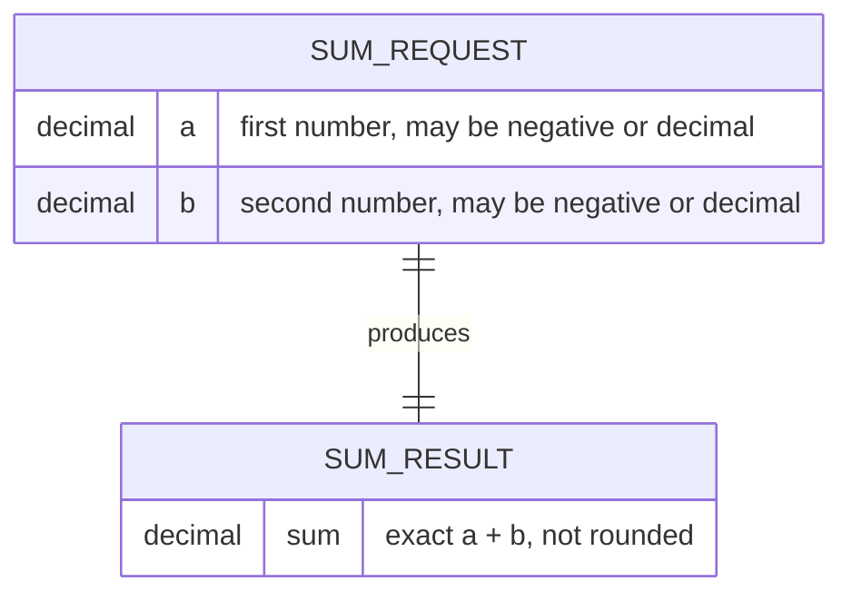

# Domain model

The product keeps no records. A calculation is a transient request and answer: two numbers in, one sum out.

```mermaid
erDiagram
    SUM_REQUEST {
        decimal a "first number, may be negative or decimal"
        decimal b "second number, may be negative or decimal"
    }
    SUM_RESULT {
        decimal sum "exact a + b, not rounded"
    }
    SUM_REQUEST ||--|| SUM_RESULT : "produces"
```

Neither entity is stored; there is no history (out of scope).