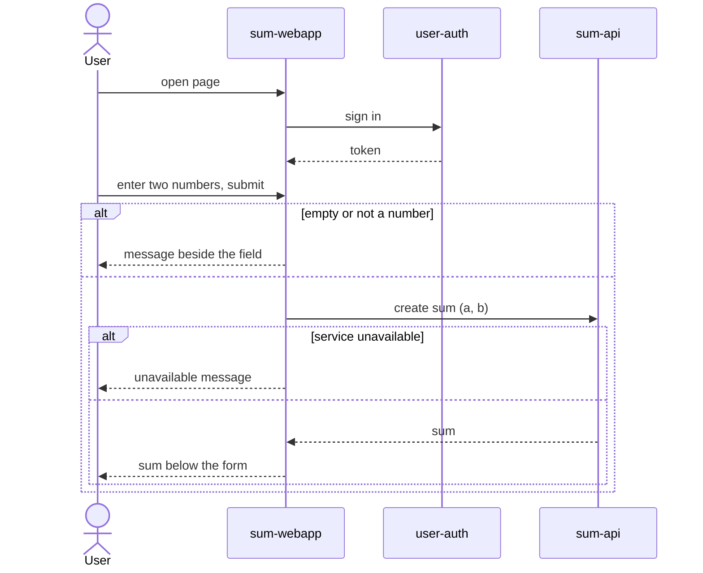

# Add two numbers

A User signs in, enters two numbers and sees the sum calculated by the back service.

```mermaid
sequenceDiagram
    actor User
    participant sum-webapp
    participant user-auth
    participant sum-api

    User->>sum-webapp: open page
    sum-webapp->>user-auth: sign in
    user-auth-->>sum-webapp: token
    User->>sum-webapp: enter two numbers, submit
    alt empty or not a number
        sum-webapp-->>User: message beside the field
    else
        sum-webapp->>sum-api: create sum (a, b)
        alt service unavailable
            sum-webapp-->>User: unavailable message
        else
            sum-api-->>sum-webapp: sum
            sum-webapp-->>User: sum below the form
        end
    end
```